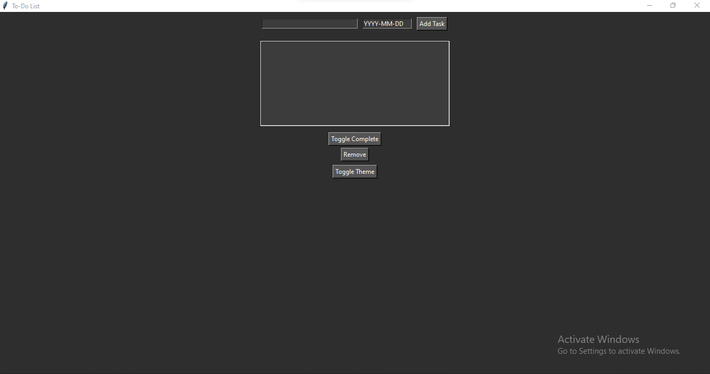

# 📝 To-Do List Desktop App (Tkinter)

A Python desktop app built with Tkinter to manage your daily tasks with features like:
- ✅ Add/remove tasks
- ✅ Mark tasks as complete
- 💾 Save/load tasks to/from a file
- 🔃 Sort tasks by completion status
- 📅 Assign due dates
- 🌗 Toggle between light/dark themes

---

## 📸 Preview



---

## 📦 Features

- Add new tasks with optional due dates.
- Remove or mark tasks as completed.
- Tasks saved in `tasks.json` (loaded on app start).
- Sorted list view (incomplete first).
- Toggle between light and dark UI themes.

---

## 🚀 How to Run

Make sure you have Python 3 installed.

```bash
git clone https://github.com/Talha146/todo-list-enhanced.git
cd todo-list-enhanced
python main.py
```

---

## 📁 Project Structure

```
todo_list_app/
│
├── main.py             # Entry point of the app
├── todo_app.py         # GUI logic
├── task_manager.py     # Task management logic
├── themes.py           # Theme configuration
├── tasks.json          # Saved tasks (auto-created)
├── README.md           # Project description
└── requirements.txt    # Dependencies
```

---

## 🛠 Tech Stack

- Python 3
- Tkinter (standard library)
- JSON (file storage)

---

## 👤 Author

Made with ❤️ by [Talha Shahzad](https://github.com/Talha146)

---

## 📝 License

This project is open-source under the [MIT License](LICENSE).
